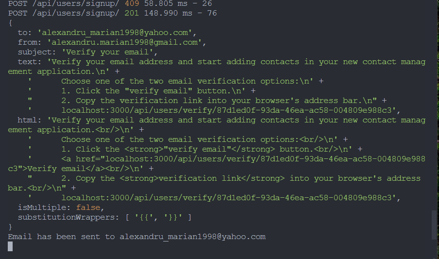
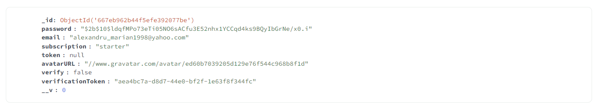
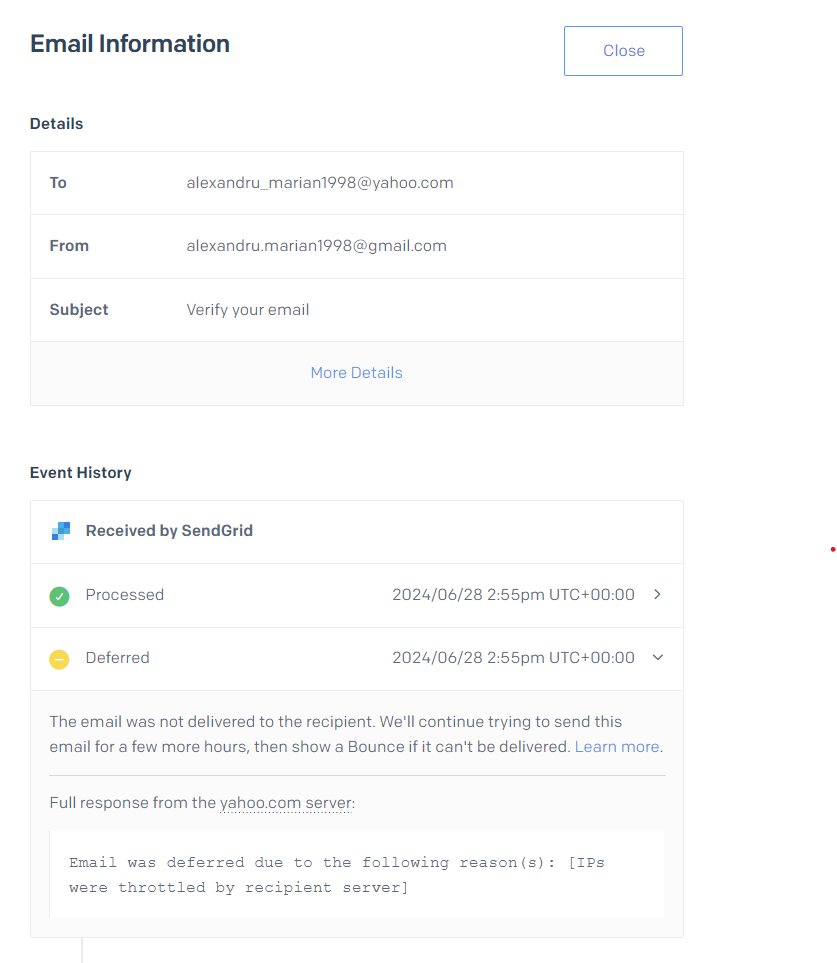
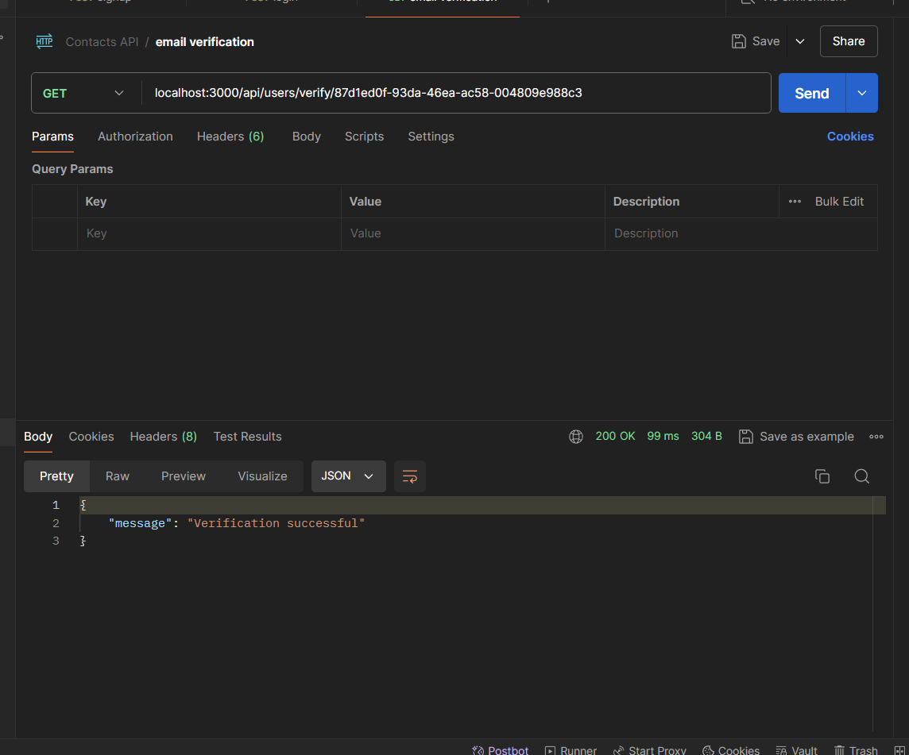
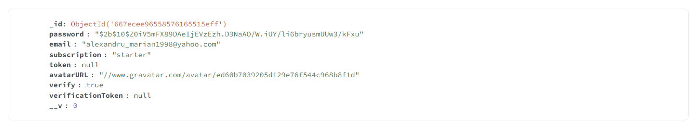
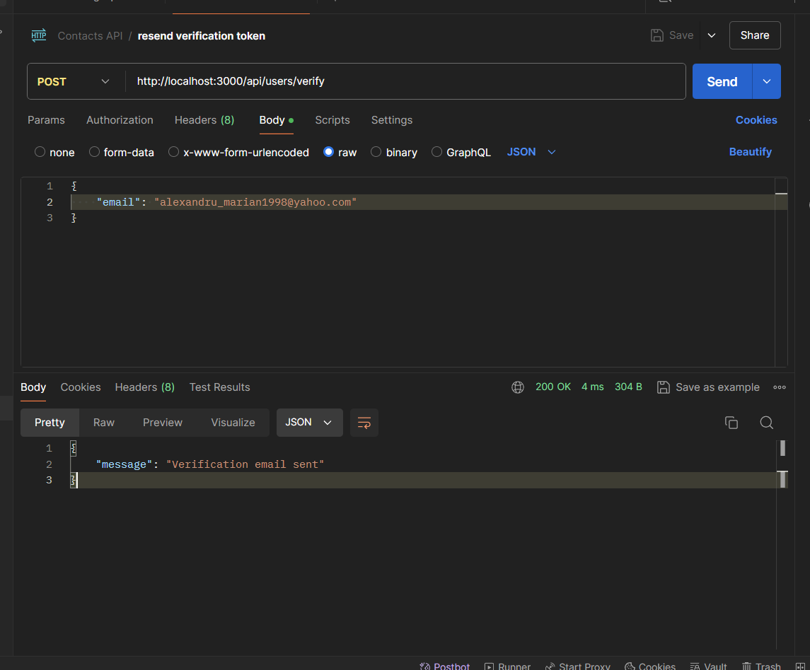
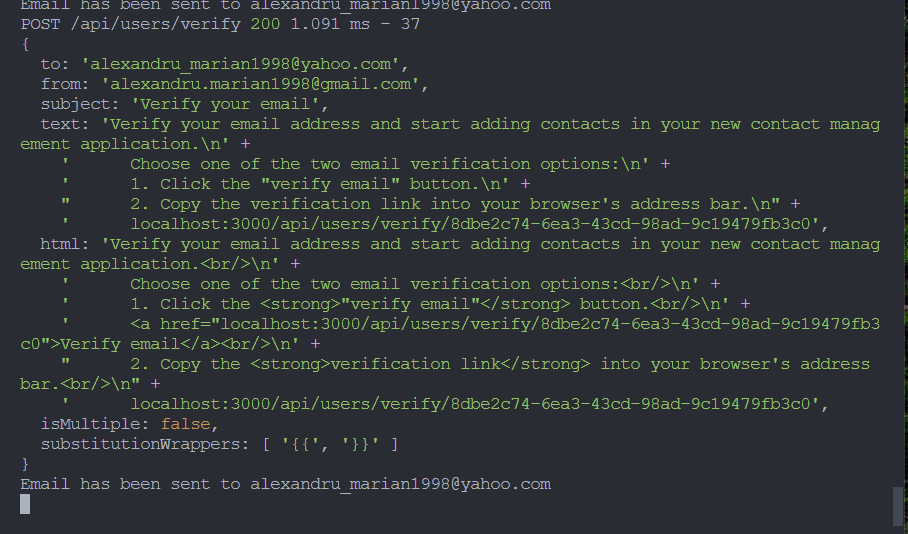

## GoIT Node.JS Homeworks from 2nd to 6th - REST API Application

### Homework 6th - Email:

- `verification token sent`

- `verification token`

- `deferred error`

- `verification token request`

- `verification passed`

- `resend-verification-token-request`

- `verification token resent`

