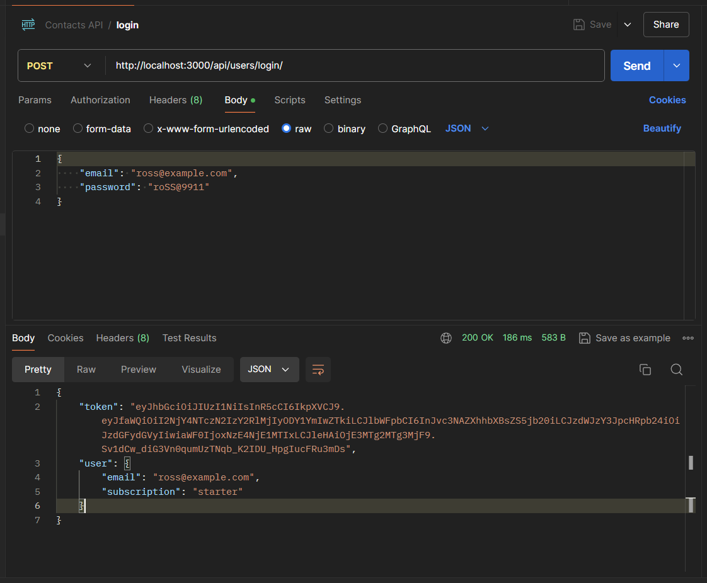
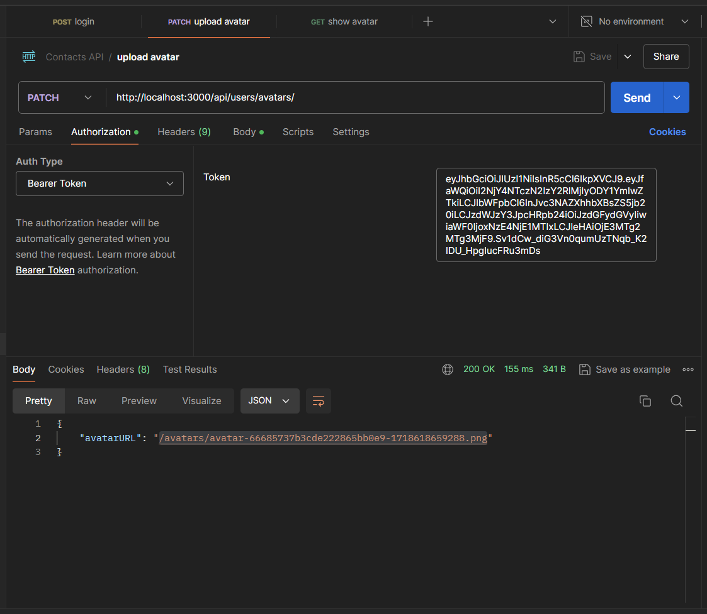
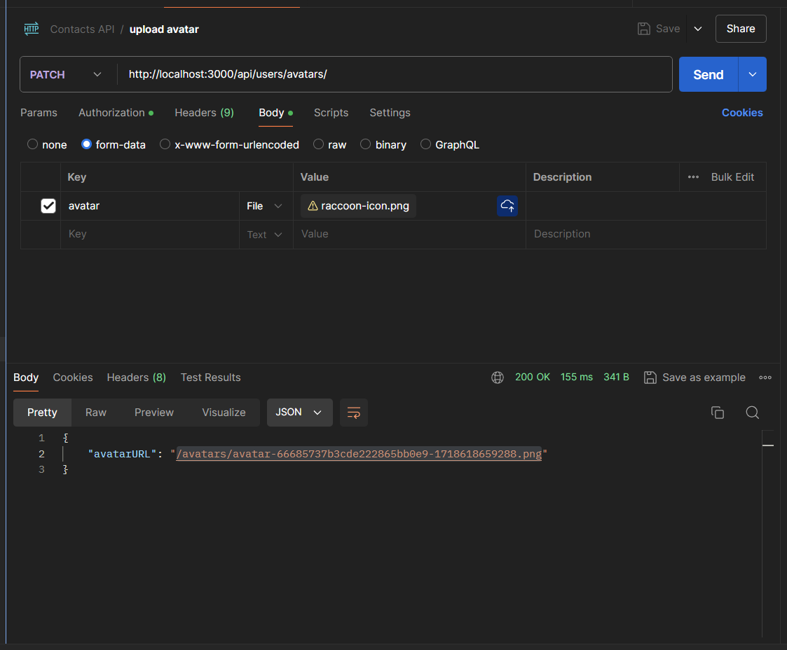
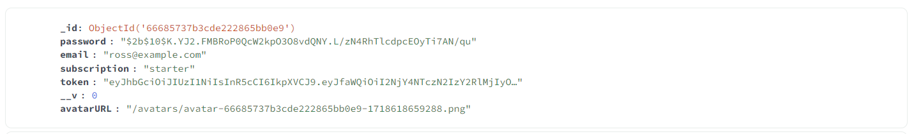
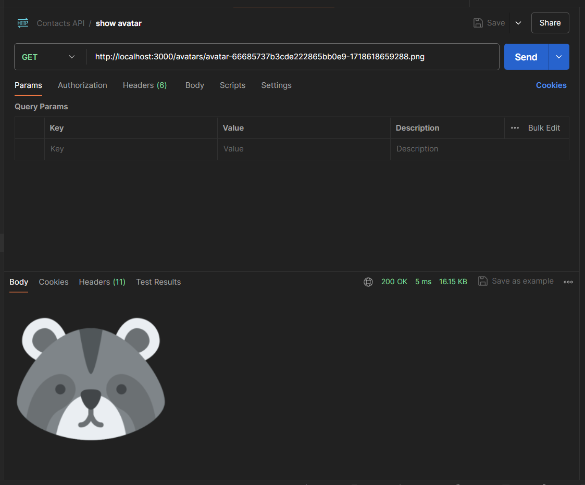

## GoIT Node.JS Homeworks from 2nd to 6th - REST API Application

### Homework 5th - Avatars:

- `login request`

- `authorization upload avatar request`

- `body upload avatar request`

- `database avatar URL`

- `show avatar request`

